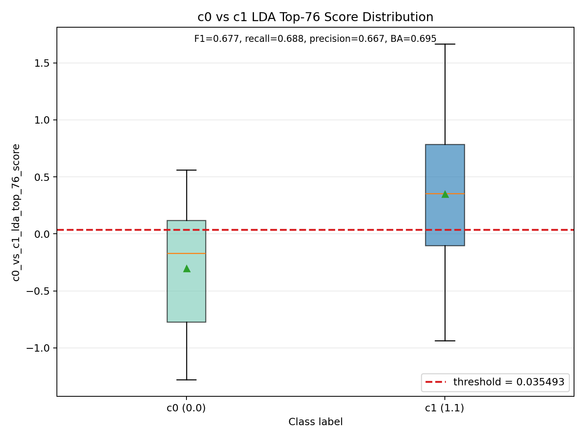
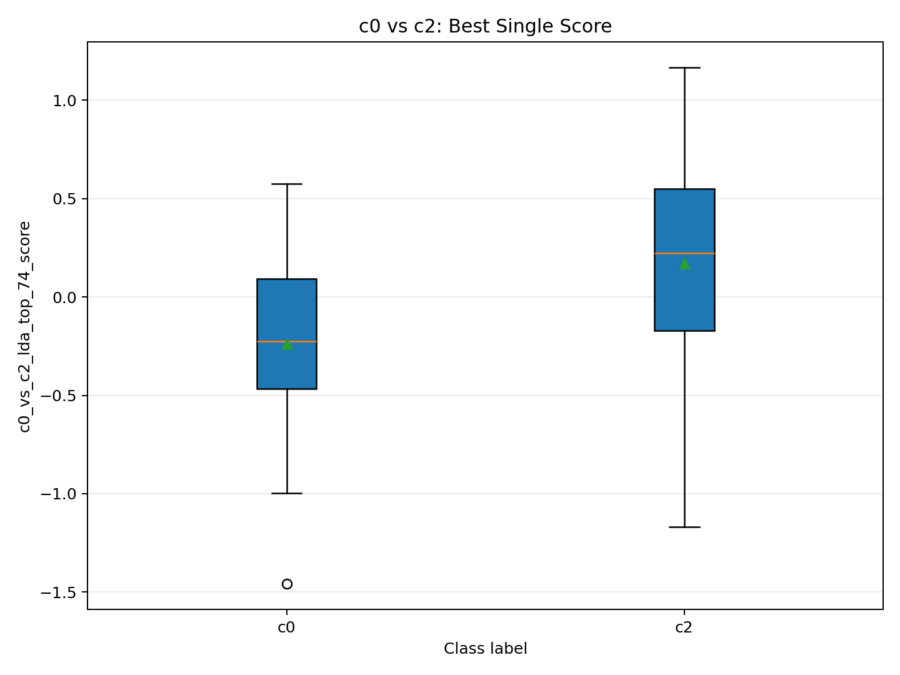
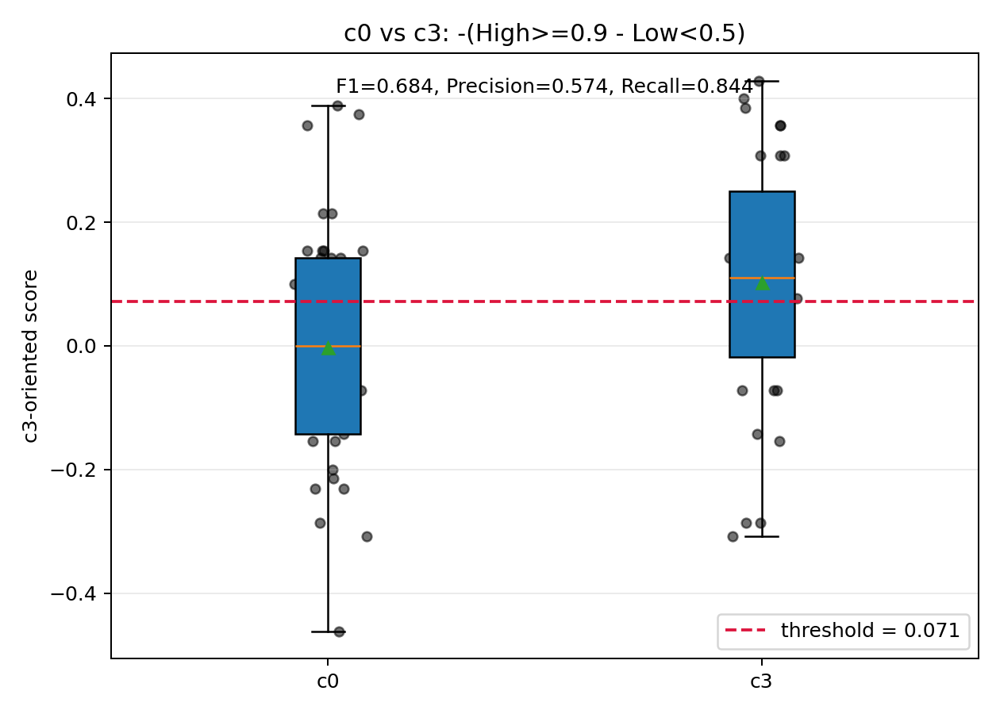
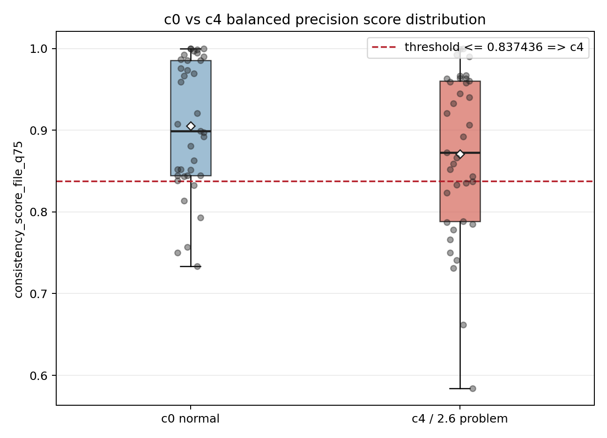

# classified_chatdev 评分与可视化复现

## 1. 工作目标

本轮工作的目标是把项目中分散的 `classified_chatdev` 处理、打分和可视化脚本整理成一个可复现目录，并形成从原始数据到最终图表的完整流水线。

输入数据为 `data/classified_chatdev`，其中 `trajectory/` 保存原始 ChatDev 运行日志，各数字目录如 `0.0`、`1.1`、`2.6` 表示人工分类标签。最终复现目录为 `reproduce_classified_chatdev/`，统一入口为：

```bash
python reproduce_classified_chatdev/run_reproduction.py
```

默认模式不调用 API，只复用已有中间产物并刷新总览表；如果需要重新调用模型完成总结和打分，则显式打开：

```bash
python reproduce_classified_chatdev/run_reproduction.py --run-api-steps --overwrite
```

这样做的原因是总结和 logprob 打分都需要 LLM API，成本较高。复现目录保留了完整能力，但默认走低成本验证路径。

## 2. 总体流水线

整体流程分为九个阶段：

1. `playbook`：从 `data/classified_chatdev/trajectory/*.log` 转换为 playbook JSON。
2. `summarize`：用 LLM 将每轮 prompt/output 拆成原子化的 `known_context`、`tasks`、`output`。
3. `scored`：对所有 summarized 文件做通用 logprob consistency 打分。
4. `scored_1`：针对 `0.0` 和 `1.1` 做 c0/c1 区分实验。
5. `scored_2`：针对 `0.0` 和 `1.3/1.5` 做 c0/c2 重复性实验。
6. `scored_3`：针对 `0.0` 和 `2.6` 做行动-推理匹配实验，并保留同文件名的多标签副本。
7. `scored_4`：同样针对 `0.0` 和 `2.6`，但只写目标标签目录，减少多标签干扰。
8. `visualize`：为 scored 数据生成 CSV 和 PNG 图表。
9. `overview`：生成总览表 `reproduce_classified_chatdev/overview/overview.csv`。

当前总览结果如下：

| 数据集 | 评分类型 | scored 文件数 | 可视化文件数 | 目标标签 | 选中文件数 |
| --- | --- | ---: | ---: | --- | ---: |
| `classified_chatdev_scored` | logprob consistency | 448 | 69 | 全标签 | - |
| `classified_chatdev_scored_1` | logprob consistency | 238 | 61 | `0.0`, `1.1` | 69 unique / 236 paths |
| `classified_chatdev_scored_2` | repetition | 329 | 7 | `0.0`, `1.3`, `1.5` | 89 unique / 329 paths |
| `classified_chatdev_scored_3` | action reasoning alignment | 268 | 7 | `0.0`, `2.6` | 74 unique / 268 paths |
| `classified_chatdev_scored_4` | action reasoning alignment | 74 | 12 | `0.0`, `2.6` | 74 unique / 74 paths |

## 3. 复现目录实现

本轮新建了 `reproduce_classified_chatdev/`，主要文件如下：

- `config.json`：集中记录输入目录、输出目录、模型、top logprobs、目标标签、premise order。
- `run_reproduction.py`：统一复现脚本，调用 `chatdev.analyzer` 中已有 API。
- `README.md`：说明运行方式和 API 开关。
- `NOTEBOOK_MAP.md`：记录旧 notebook/script 到当前复现步骤的映射。
- `overview/overview.csv` 和 `overview/overview.md`：总览表。

技术上没有把旧 notebook 整体复制进复现目录，而是把可复用的核心逻辑整理进 runner。这样可以减少冗余，同时保留与原项目 API 的连接。例如：

- `playbook` 阶段调用 `chatdev.analyzer.log_to_playbook.log_to_playbook`。
- `summarize` 阶段调用 `chatdev.analyzer.llm_summarizer.LLMSummarizer`。
- `scored/scored_1` 调用 `chatdev.analyzer.logprob_consistency.LogprobConsistencyScorer`。
- `visualize` 阶段调用 `chatdev.analyzer.consistency_visualizer.write_visualization_report`。
- `scored_2` 复用已有紧凑脚本 `scripts/build_classified_chatdev_scored_2.py`。

复现脚本还支持 `--steps` 选择局部阶段，例如：

```bash
python reproduce_classified_chatdev/run_reproduction.py --steps scored_1 overview
```

这便于组会后继续单独调某个实验，不需要全链路重跑。

## 4. Playbook 构建

原始 `classified_chatdev` 数据中，`trajectory/` 目录保存 `.log` 文件，分类目录中保存同名 `.json` 文件。playbook 阶段首先扫描 `trajectory/*.log`，然后根据分类目录建立：

```text
log stem -> [label1, label2, ...]
```

每个日志被转换为：

- `data/classified_chatdev_playbook/trajectory/{name}_playbook.json`
- `data/classified_chatdev_api_record/trajectory/{name}_api_records.jsonl`

之后再按标签复制到对应分类目录。这个设计保留了多标签样本：同一个 ChatDev 轨迹可能同时属于多个错误类别，后续不能简单按路径独立处理，否则会重复评分或漏掉多标签关系。

## 5. Summarized 数据构建

summarize 阶段把 playbook 中每轮交互转换为结构化字段：

```json
{
  "known_context": ["..."],
  "tasks": ["..."],
  "output": ["..."]
}
```

其中：

- `known_context` 表示 prompt 中的背景或已知约束。
- `tasks` 表示 prompt 中要求完成的任务。
- `output` 表示 agent 实际产出的行动或结果。

该阶段调用 `LLMSummarizer`，属于 API 成本较高的阶段。因此 runner 默认不重跑；只有传入 `--run-api-steps` 才会真正生成缺失 summarized 文件。

技术细节上，summarize 阶段保留了 canonical-by-filename 思路：同名 playbook 只应总结一次，再复制到其他标签目录，从而避免多标签样本重复调用 API。

## 6. 通用 Logprob Consistency 评分

通用一致性评分的核心思想是把“前提”和“输出项”变成二分类判断：

```text
Premises: user_demand + known_context + tasks
Hypothesis: one output item
Answer: Yes / No
```

模型只允许输出一个 token，即 `Yes` 或 `No`。然后读取 top logprobs，把正向 token 的概率质量作为 consistency score。

默认 premise order 为：

```python
["user_demand", "known_context", "tasks"]
```

这个评分被用于 `classified_chatdev_scored`，覆盖全部标签。它的优点是通用、解释性强；缺点是对具体错误类别的区分能力有限，因为很多错误类别都可能表现为“部分一致、部分不一致”。

## 7. c0/c1 实验：`classified_chatdev_scored_1`

### 7.1 实现细节

`scored_1` 的目标是区分：

- `0.0 -> c0`
- `1.1 -> c1`

筛选策略不是“只取路径在 `0.0` 或 `1.1` 目录下的文件”，而是先按文件名聚合标签：

```text
filename -> set(labels)
```

只要一个文件名出现过 `0.0` 或 `1.1`，就纳入分析，并保留所有同名路径。这样可以避免多标签样本在过滤时被破坏。

本实验使用的 premise order 是：

```python
["tasks", "user_demand"]
```

这么做是因为之前实验发现 `tasks` 本身也是任务约束，不能只依赖 user demand。

当前数据规模：

- 选中 unique filenames：69
- 选中 summarized paths：236
- scored files：238
- 可视化文件：61

### 7.2 最好结果

单纯看平均 consistency score 时，c0/c1 非常接近：

| 标签 | files | entry score mean | output score mean |
| --- | ---: | ---: | ---: |
| `0.0` | 37 | 0.6416 | 0.5588 |
| `1.1` | 32 | 0.6206 | 0.5627 |

这说明直接用均值很难区分两类。因此后续尝试了 file-level 特征、分位数、高低分率、组合指标和 LDA 方向。

当前最好、最有解释力的 c0/c1 结果来自 LDA 组合分数：

| 指标 | 数值 |
| --- | ---: |
| score key | `c0_vs_c1_lda_top_76_score` |
| c0 mean | -0.3026 |
| c1 mean | 0.3499 |
| eta2 | 0.2403 |
| AUC direction | 0.7753 |
| 最佳 F1 阈值 | -0.289516 |
| F1 | 0.7000 |
| Precision | 0.5833 |
| Recall | 0.8750 |
| Accuracy | 0.6522 |

如果更重视视觉上 c0/c1 的分离和阈值解释性，保留了一个近零阈值：

```text
score >= 0.035493 -> c1
score < 0.035493 -> c0
```

最终展示图统一放在第 11 节，只保留 `c0_vs_c1_lda_top_76_threshold_0_035_boxplot.png`。

### 7.3 尝试过但效果一般的评价方式

1. 直接使用 `consistency_score_file_mean`

   c0/c1 均值太接近，区分度不足。

2. 高召回阈值

   例如 `c0_vs_c1_lda_top_76_score` 在 recall floor 0.8 下可以达到 recall 0.9688，但 precision 只有 0.5439，误报较多。

3. 单一高低分率

   如 `high_low_gap_0_7_0_3` 等指标能提升召回，但通常牺牲 specificity，图上分离也不稳定。

4. 只看 low-score tail

   对 c1 不够敏感，因为 c1 并不总是表现为低一致性，而更像是某些局部任务约束上的模式差异。

## 8. c0/c2 重复性实验：`classified_chatdev_scored_2`

### 8.1 实现细节

`scored_2` 主要用于区分：

- `0.0 -> c0`
- `1.3 + 1.5 -> c2`

这里不再使用通用 Yes/No consistency，而是调用 `chatdev.analyzer.repetition_scoring`，计算重复性相关指标，并提供兼容字段：

```text
consistency_score_mean = 1 - repetition_score_mean__fm_1_3
```

筛选策略仍然是 filename-level target label hit：只要同名文件出现在 `0.0`、`1.3` 或 `1.5`，就纳入分析，并保留同名多标签副本。

当前数据规模：

- 选中 unique filenames：89
- scored files：329
- 可视化文件：7

### 8.2 最好结果

c0/c2 的最好结果来自 LDA 组合分数：

| 指标 | 数值 |
| --- | ---: |
| score key | `c0_vs_c2_lda_top_74_score` |
| c0 mean | -0.2394 |
| c2 mean | 0.1703 |
| eta2 | 0.1533 |
| AUC direction | 0.7370 |
| threshold | -0.375470 |
| F1 | 0.7705 |
| Precision | 0.6714 |
| Recall | 0.9038 |
| Accuracy | 0.6854 |

最终展示图统一放在第 11 节，只保留 `c0_vs_c2_best_single_score_boxplot.png`。

### 8.3 尝试过但效果一般的评价方式

1. 直接使用低分位一致性，例如 `consistency_score_file_q25`

   该指标在 c0/c2 上 recall 可到 1.0，但 specificity 只有 0.1081，几乎把大量 c0 也判成 c2。

2. 只用单个重复性阈值

   对部分强重复样本有效，但 c2 内部并不完全同质，单指标不如 LDA 组合稳定。

3. 过度追求高召回

   会导致 precision 明显下降，不适合直接作为最终分类标准。

## 9. c0/c26 行动-推理匹配实验：`classified_chatdev_scored_3`

### 9.1 实现细节

`scored_3` 针对：

- `0.0 -> c0`
- `2.6 -> c26`

2.6 类被理解为 Action-Reasoning Mismatch，即实际行动与推理或任务上下文不匹配。

该实验重新定义了 judge prompt：

```text
REASONING_AND_TASK_CONTEXT = known_context + tasks
ACTUAL_ACTION = output item
Answer = Yes / No
```

模型输出 `Yes` 表示行动与推理/任务上下文一致；输出 `No` 表示可能存在行动-推理错配。每个 output item 都生成：

```json
output_action_reasoning_alignment_scores
action_reasoning_alignment_score_mean
action_reasoning_alignment_score_min
action_reasoning_alignment_score_max
```

`scored_3` 的写入策略是：只要同名文件命中过 `0.0` 或 `2.6`，就保留所有同名路径。因此它保留了更多多标签副本。

当前数据规模：

- selected unique filenames：74
- selected summarized paths：268
- scored files：268

### 9.2 最好结果

c0/c26 alignment 的最好行：

| 指标 | 数值 |
| --- | ---: |
| score key | `alignment_score_min` |
| direction | `low_is_2.6` |
| eta2 | 0.0279 |
| threshold | 1.36e-7 |
| F1 | 0.7273 |
| Precision | 0.6275 |
| Recall | 0.8649 |
| Accuracy | 0.6757 |
| Specificity | 0.4865 |

该早期 c0/c26 图不再放入组会展示。最终 c3 展示改用 `c0_vs_c3_best_single_score_boxplot.png`，并统一放在第 11 节。

### 9.3 效果评价

这个方向的 F1 看起来不低，但 eta2 很低，说明两类分布的整体分离度较弱。换句话说，阈值能抓到一部分 2.6，但图上的类间距离不大。

可能原因：

- `2.6` 的错误定义更偏语义，需要上下文更长、更细的推理链。
- 只用 `known_context + tasks` 与 `output` 做局部判断，可能不足以覆盖完整的 phase-level 意图变化。
- 多标签副本被保留后，样本间重叠增强，降低了视觉分离度。

## 10. c0/c4 目标目录实验：`classified_chatdev_scored_4`

### 10.1 实现细节

`scored_4` 与 `scored_3` 使用相同的行动-推理匹配 judge，但输出策略不同：

- 只写 `0.0` 和 `2.6` 目录。
- 不把同名文件在其他标签目录的副本也写入输出。

这样做是为了减少多标签目录带来的干扰，更直接地看 c0 与 c4/c26 的二分类效果。

当前数据规模：

- selected unique filenames：74
- selected summarized paths：74
- scored files：74

### 10.2 最好结果

标准 c0/c4 指标中，最好的 F1 行为：

| 指标 | 数值 |
| --- | ---: |
| score key | `high_low_gap_0_7_0_5` |
| direction | `low_is_c4` |
| eta2 | 0.0427 |
| threshold | 0.2967 |
| F1 | 0.7234 |
| Precision | 0.5965 |
| Recall | 0.9189 |
| Accuracy | 0.6486 |

另一个更均衡的候选：

| 指标 | 数值 |
| --- | ---: |
| score key | `failure_sensitive_score` |
| eta2 | 0.0801 |
| F1 | 0.7191 |
| Precision | 0.6154 |
| Recall | 0.8649 |
| Accuracy | 0.6622 |

如果更重视 precision，可以选择：

| 策略 | score key | Precision | Recall | Specificity | F1 |
| --- | --- | ---: | ---: | ---: | ---: |
| precision first | `high_density_score_0_8` | 0.8000 | 0.3243 | 0.9189 | 0.4615 |
| balanced precision >= 0.70 | `consistency_score_file_q75` | 0.7000 | 0.3784 | 0.8378 | 0.4912 |
| balanced F0.5 | `high_low_half_penalty_0_8_0_2` | 0.6800 | 0.4595 | 0.7838 | 0.5484 |

最终展示图统一放在第 11 节，只保留 `c0_vs_c4_consistency_score_file_q75_threshold_0_837436_boxplot.png`。

### 10.3 尝试过但效果一般的评价方式

1. 纯 action-reasoning alignment 分数

   分布差异较弱，eta2 普遍不高。

2. 高 precision 策略

   Precision 可以提高到 0.8，但 recall 下降到 0.3243，漏检较多。

3. 只看最高分或最低分

   容易被单轮异常影响，稳定性不如 failure-sensitive 或 high/low rate 组合。

## 11. 最终展示图与分类标准

组会展示只保留四张最终分类标准图。其他阈值扫描图、候选指标图、热力图和聚类图只作为后台分析文件，不放入报告正文。

四个任务都以 `c0` 作为“无问题”基线，以目标类别作为阳性样本。主要评价指标如下：

| Target | 分类标准 | F1 | Accuracy | Precision | Recall | Specificity | Eta2 |
| --- | --- | ---: | ---: | ---: | ---: | ---: | ---: |
| c1 | `c0_vs_c1_lda_top_76_score >= 0.035493` | 0.6769 | 0.6957 | 0.6667 | 0.6875 | 0.7027 | 0.2403 |
| c2 | `c0_vs_c2_lda_top_74_score >= -0.375470` | 0.7705 | 0.6854 | 0.6714 | 0.9038 | 0.3784 | 0.1533 |
| c3 | `high_low_gap_0_9_0_5 <= 0.071429` | 0.6835 | 0.6377 | 0.5745 | 0.8438 | 0.4595 | 0.0653 |
| c4 | `consistency_score_file_q75 <= 0.837436` | 0.4912 | 0.6081 | 0.7000 | 0.3784 | 0.8378 | 0.0344 |

### 11.1 c0/c1：LDA top-76 近零阈值



评价方法：有reference

- case误报？
- 找点case -> 工作量
- 有支撑的评价


1. 干净数据集
2. 分类 ：阈值
3. repair -> prompt（）


`c0_vs_c1_lda_top_76_score` 是 c0/c1 中分离度最强的组合分数，eta2 达到 0.2403。最终采用近零阈值 `0.035493`，使 precision、recall 和 accuracy 都保持在相对均衡的水平。

### 11.2 c0/c2：最佳单一组合分数



`c0_vs_c2_lda_top_74_score` 是 c2 当前最强的分类标准，F1 为 0.7705，recall 达到 0.9038，说明大多数 c2 阳性样本都能被捕捉。它的不足是 specificity 较低，仍会把一部分 c0 判为 c2。

### 11.3 c0/c3：最佳单一分数



`high_low_gap_0_9_0_5` 对 c3 有一定识别能力，F1 为 0.6835，recall 为 0.8438。eta2 只有 0.0653，说明它更多是阈值上可用，但两类分布的视觉分离仍不算强。

### 11.4 c0/c4：precision-balanced q75 分数



`consistency_score_file_q75` 用于识别行动-推理错配类 c4。由于 c4 更需要高 precision，本轮选择 `0.837436` 作为平衡阈值：precision 为 0.7000，specificity 为 0.8378；代价是 recall 降到 0.3784。

## 12. 主要结论

1. 复现链路已经整理完成

   从 `data/classified_chatdev` 到 playbook、summarized、scored、visualization、overview 都有统一入口。API 调用被显式开关控制，适合后续低成本复现。

2. c0/c1 的最佳区分来自组合特征，而不是平均分

   单纯 consistency mean 无法区分 c0/c1；LDA 组合后的 `c0_vs_c1_lda_top_76_score` 效果最好，AUC 约 0.775，F1 约 0.700。

3. c0/c2 的重复性方向相对有效

   使用 repetition-derived 指标后，c0/c2 可以达到 F1 约 0.7705，recall 约 0.9038。

4. c0/c26 / c0/c4 的行动-推理匹配方向有信号，但分布分离弱

   F1 可以到 0.72 左右，但 eta2 较低，说明阈值分类有一定效果，视觉分离和稳健性仍有限。

5. 多标签文件必须按 filename 聚合处理

   这是整个流程中最重要的数据契约。不能只按路径过滤，否则会破坏同一轨迹的多标签关系，也可能导致重复 API 调用。

## 13. 后续建议

1. 对 c0/c1 固化 `c0_vs_c1_lda_top_76_score` 和近零阈值 `0.035493`，作为下一轮人工复核的候选规则。

2. 对 c0/c2 继续保留 repetition-based 方向，因为它比通用 consistency 更贴近该类错误。

3. 对 c0/c4/c26 引入更强上下文特征，例如 phase transition、前后轮状态变化、role-level action chain，而不仅仅是单轮 `known_context/tasks -> output`。

4. 把 `overview.csv` 作为每次实验后的固定检查项，保证 scored 文件数、可视化文件数、manifest 和 label summary 都可追踪。
